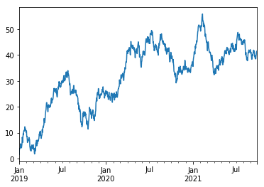
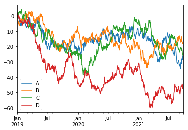

```python
import numpy as np
import pandas as pd
s = pd.Series([1,3,5,np.nan,6,8])
s
```


    0    1.0
    1    3.0
    2    5.0
    3    NaN
    4    6.0
    5    8.0
    dtype: float64


```python
dates = pd.date_range('20190101',periods=6)
dates
```


    DatetimeIndex(['2019-01-01', '2019-01-02', '2019-01-03', '2019-01-04',
                   '2019-01-05', '2019-01-06'],
                  dtype='datetime64[ns]', freq='D')


```python
df = pd.DataFrame(np.random.randn(6,4),index=dates,columns=list('ABCD'))
df
```


<div>
<style>
    .dataframe thead tr:only-child th {
        text-align: right;
    }

    .dataframe thead th {
        text-align: left;
    }

    .dataframe tbody tr th {
        vertical-align: top;
    }
</style>
<table border="1" class="dataframe">
  <thead>
    <tr style="text-align: right;">
      <th></th>
      <th>A</th>
      <th>B</th>
      <th>C</th>
      <th>D</th>
    </tr>
  </thead>
  <tbody>
    <tr>
      <th>2019-01-01</th>
      <td>-0.523032</td>
      <td>-0.828092</td>
      <td>0.673426</td>
      <td>1.327369</td>
    </tr>
    <tr>
      <th>2019-01-02</th>
      <td>-0.338324</td>
      <td>-0.658966</td>
      <td>-0.030027</td>
      <td>-0.463307</td>
    </tr>
    <tr>
      <th>2019-01-03</th>
      <td>1.112748</td>
      <td>-0.390470</td>
      <td>-0.017147</td>
      <td>-2.217214</td>
    </tr>
    <tr>
      <th>2019-01-04</th>
      <td>-0.325444</td>
      <td>-0.667723</td>
      <td>-0.617872</td>
      <td>-0.043445</td>
    </tr>
    <tr>
      <th>2019-01-05</th>
      <td>1.247420</td>
      <td>-0.941117</td>
      <td>-0.107166</td>
      <td>1.022153</td>
    </tr>
    <tr>
      <th>2019-01-06</th>
      <td>0.185418</td>
      <td>-0.206419</td>
      <td>-0.264368</td>
      <td>-1.919342</td>
    </tr>
  </tbody>
</table>
</div>


```python
df2 = pd.DataFrame({'A': 1.,
      'B': pd.Timestamp('20190102'),
      'C': pd.Series(1, index=list(range(4)), dtype='float32'),
      'D': np.array([3] * 4, dtype='int32'),
      'E': pd.Categorical(["test", "train", "test", "train"]),
      'F': 'foo'})
df2
```


<div>
<style>
    .dataframe thead tr:only-child th {
        text-align: right;
    }

    .dataframe thead th {
        text-align: left;
    }

    .dataframe tbody tr th {
        vertical-align: top;
    }
</style>
<table border="1" class="dataframe">
  <thead>
    <tr style="text-align: right;">
      <th></th>
      <th>A</th>
      <th>B</th>
      <th>C</th>
      <th>D</th>
      <th>E</th>
      <th>F</th>
    </tr>
  </thead>
  <tbody>
    <tr>
      <th>0</th>
      <td>1.0</td>
      <td>2019-01-02</td>
      <td>1.0</td>
      <td>3</td>
      <td>test</td>
      <td>foo</td>
    </tr>
    <tr>
      <th>1</th>
      <td>1.0</td>
      <td>2019-01-02</td>
      <td>1.0</td>
      <td>3</td>
      <td>train</td>
      <td>foo</td>
    </tr>
    <tr>
      <th>2</th>
      <td>1.0</td>
      <td>2019-01-02</td>
      <td>1.0</td>
      <td>3</td>
      <td>test</td>
      <td>foo</td>
    </tr>
    <tr>
      <th>3</th>
      <td>1.0</td>
      <td>2019-01-02</td>
      <td>1.0</td>
      <td>3</td>
      <td>train</td>
      <td>foo</td>
    </tr>
  </tbody>
</table>
</div>


```python
df2.dtypes
```


    A           float64
    B    datetime64[ns]
    C           float32
    D             int32
    E          category
    F            object
    dtype: object


```python
df.head()

```


<div>
<style>
    .dataframe thead tr:only-child th {
        text-align: right;
    }

    .dataframe thead th {
        text-align: left;
    }

    .dataframe tbody tr th {
        vertical-align: top;
    }
</style>
<table border="1" class="dataframe">
  <thead>
    <tr style="text-align: right;">
      <th></th>
      <th>A</th>
      <th>B</th>
      <th>C</th>
      <th>D</th>
    </tr>
  </thead>
  <tbody>
    <tr>
      <th>2019-01-01</th>
      <td>-0.523032</td>
      <td>-0.828092</td>
      <td>0.673426</td>
      <td>1.327369</td>
    </tr>
    <tr>
      <th>2019-01-02</th>
      <td>-0.338324</td>
      <td>-0.658966</td>
      <td>-0.030027</td>
      <td>-0.463307</td>
    </tr>
    <tr>
      <th>2019-01-03</th>
      <td>1.112748</td>
      <td>-0.390470</td>
      <td>-0.017147</td>
      <td>-2.217214</td>
    </tr>
    <tr>
      <th>2019-01-04</th>
      <td>-0.325444</td>
      <td>-0.667723</td>
      <td>-0.617872</td>
      <td>-0.043445</td>
    </tr>
    <tr>
      <th>2019-01-05</th>
      <td>1.247420</td>
      <td>-0.941117</td>
      <td>-0.107166</td>
      <td>1.022153</td>
    </tr>
  </tbody>
</table>
</div>


```python
df.tail(2)
```


<div>
<style>
    .dataframe thead tr:only-child th {
        text-align: right;
    }

    .dataframe thead th {
        text-align: left;
    }

    .dataframe tbody tr th {
        vertical-align: top;
    }
</style>
<table border="1" class="dataframe">
  <thead>
    <tr style="text-align: right;">
      <th></th>
      <th>A</th>
      <th>B</th>
      <th>C</th>
      <th>D</th>
    </tr>
  </thead>
  <tbody>
    <tr>
      <th>2019-01-05</th>
      <td>1.247420</td>
      <td>-0.941117</td>
      <td>-0.107166</td>
      <td>1.022153</td>
    </tr>
    <tr>
      <th>2019-01-06</th>
      <td>0.185418</td>
      <td>-0.206419</td>
      <td>-0.264368</td>
      <td>-1.919342</td>
    </tr>
  </tbody>
</table>
</div>


```python
df.index
```


    DatetimeIndex(['2019-01-01', '2019-01-02', '2019-01-03', '2019-01-04',
                   '2019-01-05', '2019-01-06'],
                  dtype='datetime64[ns]', freq='D')


```python
df.columns
```


    Index(['A', 'B', 'C', 'D'], dtype='object')


```python
df.describe()
```


<div>
<style>
    .dataframe thead tr:only-child th {
        text-align: right;
    }

    .dataframe thead th {
        text-align: left;
    }

    .dataframe tbody tr th {
        vertical-align: top;
    }
</style>
<table border="1" class="dataframe">
  <thead>
    <tr style="text-align: right;">
      <th></th>
      <th>A</th>
      <th>B</th>
      <th>C</th>
      <th>D</th>
    </tr>
  </thead>
  <tbody>
    <tr>
      <th>count</th>
      <td>6.000000</td>
      <td>6.000000</td>
      <td>6.000000</td>
      <td>6.000000</td>
    </tr>
    <tr>
      <th>mean</th>
      <td>0.226464</td>
      <td>-0.615464</td>
      <td>-0.060526</td>
      <td>-0.382298</td>
    </tr>
    <tr>
      <th>std</th>
      <td>0.776514</td>
      <td>0.273431</td>
      <td>0.423287</td>
      <td>1.466032</td>
    </tr>
    <tr>
      <th>min</th>
      <td>-0.523032</td>
      <td>-0.941117</td>
      <td>-0.617872</td>
      <td>-2.217214</td>
    </tr>
    <tr>
      <th>25%</th>
      <td>-0.335104</td>
      <td>-0.787999</td>
      <td>-0.225068</td>
      <td>-1.555333</td>
    </tr>
    <tr>
      <th>50%</th>
      <td>-0.070013</td>
      <td>-0.663344</td>
      <td>-0.068596</td>
      <td>-0.253376</td>
    </tr>
    <tr>
      <th>75%</th>
      <td>0.880915</td>
      <td>-0.457594</td>
      <td>-0.020367</td>
      <td>0.755754</td>
    </tr>
    <tr>
      <th>max</th>
      <td>1.247420</td>
      <td>-0.206419</td>
      <td>0.673426</td>
      <td>1.327369</td>
    </tr>
  </tbody>
</table>
</div>


```python
df.T
```


<div>
<style>
    .dataframe thead tr:only-child th {
        text-align: right;
    }

    .dataframe thead th {
        text-align: left;
    }

    .dataframe tbody tr th {
        vertical-align: top;
    }
</style>
<table border="1" class="dataframe">
  <thead>
    <tr style="text-align: right;">
      <th></th>
      <th>2019-01-01 00:00:00</th>
      <th>2019-01-02 00:00:00</th>
      <th>2019-01-03 00:00:00</th>
      <th>2019-01-04 00:00:00</th>
      <th>2019-01-05 00:00:00</th>
      <th>2019-01-06 00:00:00</th>
    </tr>
  </thead>
  <tbody>
    <tr>
      <th>A</th>
      <td>-0.523032</td>
      <td>-0.338324</td>
      <td>1.112748</td>
      <td>-0.325444</td>
      <td>1.247420</td>
      <td>0.185418</td>
    </tr>
    <tr>
      <th>B</th>
      <td>-0.828092</td>
      <td>-0.658966</td>
      <td>-0.390470</td>
      <td>-0.667723</td>
      <td>-0.941117</td>
      <td>-0.206419</td>
    </tr>
    <tr>
      <th>C</th>
      <td>0.673426</td>
      <td>-0.030027</td>
      <td>-0.017147</td>
      <td>-0.617872</td>
      <td>-0.107166</td>
      <td>-0.264368</td>
    </tr>
    <tr>
      <th>D</th>
      <td>1.327369</td>
      <td>-0.463307</td>
      <td>-2.217214</td>
      <td>-0.043445</td>
      <td>1.022153</td>
      <td>-1.919342</td>
    </tr>
  </tbody>
</table>
</div>


```python
df.sort_index(axis=1, ascending=False)
```


<div>
<style>
    .dataframe thead tr:only-child th {
        text-align: right;
    }

    .dataframe thead th {
        text-align: left;
    }

    .dataframe tbody tr th {
        vertical-align: top;
    }
</style>
<table border="1" class="dataframe">
  <thead>
    <tr style="text-align: right;">
      <th></th>
      <th>D</th>
      <th>C</th>
      <th>B</th>
      <th>A</th>
    </tr>
  </thead>
  <tbody>
    <tr>
      <th>2019-01-01</th>
      <td>1.327369</td>
      <td>0.673426</td>
      <td>-0.828092</td>
      <td>-0.523032</td>
    </tr>
    <tr>
      <th>2019-01-02</th>
      <td>-0.463307</td>
      <td>-0.030027</td>
      <td>-0.658966</td>
      <td>-0.338324</td>
    </tr>
    <tr>
      <th>2019-01-03</th>
      <td>-2.217214</td>
      <td>-0.017147</td>
      <td>-0.390470</td>
      <td>1.112748</td>
    </tr>
    <tr>
      <th>2019-01-04</th>
      <td>-0.043445</td>
      <td>-0.617872</td>
      <td>-0.667723</td>
      <td>-0.325444</td>
    </tr>
    <tr>
      <th>2019-01-05</th>
      <td>1.022153</td>
      <td>-0.107166</td>
      <td>-0.941117</td>
      <td>1.247420</td>
    </tr>
    <tr>
      <th>2019-01-06</th>
      <td>-1.919342</td>
      <td>-0.264368</td>
      <td>-0.206419</td>
      <td>0.185418</td>
    </tr>
  </tbody>
</table>
</div>


```python
df.sort_values(by='B')
```


<div>
<style>
    .dataframe thead tr:only-child th {
        text-align: right;
    }

    .dataframe thead th {
        text-align: left;
    }

    .dataframe tbody tr th {
        vertical-align: top;
    }
</style>
<table border="1" class="dataframe">
  <thead>
    <tr style="text-align: right;">
      <th></th>
      <th>A</th>
      <th>B</th>
      <th>C</th>
      <th>D</th>
    </tr>
  </thead>
  <tbody>
    <tr>
      <th>2019-01-05</th>
      <td>1.247420</td>
      <td>-0.941117</td>
      <td>-0.107166</td>
      <td>1.022153</td>
    </tr>
    <tr>
      <th>2019-01-01</th>
      <td>-0.523032</td>
      <td>-0.828092</td>
      <td>0.673426</td>
      <td>1.327369</td>
    </tr>
    <tr>
      <th>2019-01-04</th>
      <td>-0.325444</td>
      <td>-0.667723</td>
      <td>-0.617872</td>
      <td>-0.043445</td>
    </tr>
    <tr>
      <th>2019-01-02</th>
      <td>-0.338324</td>
      <td>-0.658966</td>
      <td>-0.030027</td>
      <td>-0.463307</td>
    </tr>
    <tr>
      <th>2019-01-03</th>
      <td>1.112748</td>
      <td>-0.390470</td>
      <td>-0.017147</td>
      <td>-2.217214</td>
    </tr>
    <tr>
      <th>2019-01-06</th>
      <td>0.185418</td>
      <td>-0.206419</td>
      <td>-0.264368</td>
      <td>-1.919342</td>
    </tr>
  </tbody>
</table>
</div>


```python
df.iloc[1:3, :]
```


<div>
<style>
    .dataframe thead tr:only-child th {
        text-align: right;
    }

    .dataframe thead th {
        text-align: left;
    }

    .dataframe tbody tr th {
        vertical-align: top;
    }
</style>
<table border="1" class="dataframe">
  <thead>
    <tr style="text-align: right;">
      <th></th>
      <th>A</th>
      <th>B</th>
      <th>C</th>
      <th>D</th>
    </tr>
  </thead>
  <tbody>
    <tr>
      <th>2019-01-02</th>
      <td>-0.338324</td>
      <td>-0.658966</td>
      <td>-0.030027</td>
      <td>-0.463307</td>
    </tr>
    <tr>
      <th>2019-01-03</th>
      <td>1.112748</td>
      <td>-0.390470</td>
      <td>-0.017147</td>
      <td>-2.217214</td>
    </tr>
  </tbody>
</table>
</div>


```python
df.iloc[:, 1:3]
```


<div>
<style>
    .dataframe thead tr:only-child th {
        text-align: right;
    }

    .dataframe thead th {
        text-align: left;
    }

    .dataframe tbody tr th {
        vertical-align: top;
    }
</style>
<table border="1" class="dataframe">
  <thead>
    <tr style="text-align: right;">
      <th></th>
      <th>B</th>
      <th>C</th>
    </tr>
  </thead>
  <tbody>
    <tr>
      <th>2019-01-01</th>
      <td>-0.828092</td>
      <td>0.673426</td>
    </tr>
    <tr>
      <th>2019-01-02</th>
      <td>-0.658966</td>
      <td>-0.030027</td>
    </tr>
    <tr>
      <th>2019-01-03</th>
      <td>-0.390470</td>
      <td>-0.017147</td>
    </tr>
    <tr>
      <th>2019-01-04</th>
      <td>-0.667723</td>
      <td>-0.617872</td>
    </tr>
    <tr>
      <th>2019-01-05</th>
      <td>-0.941117</td>
      <td>-0.107166</td>
    </tr>
    <tr>
      <th>2019-01-06</th>
      <td>-0.206419</td>
      <td>-0.264368</td>
    </tr>
  </tbody>
</table>
</div>


```python
df.iloc[1, 1]
```


    -0.6589657573548291


```python
#等价前面方法
df.iat[1, 1]
```


    -0.6589657573548291


```python
df[df.A > 0]
```


<div>
<style>
    .dataframe thead tr:only-child th {
        text-align: right;
    }

    .dataframe thead th {
        text-align: left;
    }

    .dataframe tbody tr th {
        vertical-align: top;
    }
</style>
<table border="1" class="dataframe">
  <thead>
    <tr style="text-align: right;">
      <th></th>
      <th>A</th>
      <th>B</th>
      <th>C</th>
      <th>D</th>
    </tr>
  </thead>
  <tbody>
    <tr>
      <th>2019-01-03</th>
      <td>1.112748</td>
      <td>-0.390470</td>
      <td>-0.017147</td>
      <td>-2.217214</td>
    </tr>
    <tr>
      <th>2019-01-05</th>
      <td>1.247420</td>
      <td>-0.941117</td>
      <td>-0.107166</td>
      <td>1.022153</td>
    </tr>
    <tr>
      <th>2019-01-06</th>
      <td>0.185418</td>
      <td>-0.206419</td>
      <td>-0.264368</td>
      <td>-1.919342</td>
    </tr>
  </tbody>
</table>
</div>


```python
df[df > 0]
```


<div>
<style>
    .dataframe thead tr:only-child th {
        text-align: right;
    }

    .dataframe thead th {
        text-align: left;
    }

    .dataframe tbody tr th {
        vertical-align: top;
    }
</style>
<table border="1" class="dataframe">
  <thead>
    <tr style="text-align: right;">
      <th></th>
      <th>A</th>
      <th>B</th>
      <th>C</th>
      <th>D</th>
    </tr>
  </thead>
  <tbody>
    <tr>
      <th>2019-01-01</th>
      <td>NaN</td>
      <td>NaN</td>
      <td>0.673426</td>
      <td>1.327369</td>
    </tr>
    <tr>
      <th>2019-01-02</th>
      <td>NaN</td>
      <td>NaN</td>
      <td>NaN</td>
      <td>NaN</td>
    </tr>
    <tr>
      <th>2019-01-03</th>
      <td>1.112748</td>
      <td>NaN</td>
      <td>NaN</td>
      <td>NaN</td>
    </tr>
    <tr>
      <th>2019-01-04</th>
      <td>NaN</td>
      <td>NaN</td>
      <td>NaN</td>
      <td>NaN</td>
    </tr>
    <tr>
      <th>2019-01-05</th>
      <td>1.247420</td>
      <td>NaN</td>
      <td>NaN</td>
      <td>1.022153</td>
    </tr>
    <tr>
      <th>2019-01-06</th>
      <td>0.185418</td>
      <td>NaN</td>
      <td>NaN</td>
      <td>NaN</td>
    </tr>
  </tbody>
</table>
</div>


```python
df2 = df.copy()
df2['E'] = ['one', 'one', 'two', 'three', 'four', 'three']
print(df2)
df2[df2['E'].isin(['two', 'four'])]
```

                       A         B         C         D      E
    2019-01-01 -0.523032 -0.828092  0.673426  1.327369    one
    2019-01-02 -0.338324 -0.658966 -0.030027 -0.463307    one
    2019-01-03  1.112748 -0.390470 -0.017147 -2.217214    two
    2019-01-04 -0.325444 -0.667723 -0.617872 -0.043445  three
    2019-01-05  1.247420 -0.941117 -0.107166  1.022153   four
    2019-01-06  0.185418 -0.206419 -0.264368 -1.919342  three
    


<div>
<style>
    .dataframe thead tr:only-child th {
        text-align: right;
    }

    .dataframe thead th {
        text-align: left;
    }

    .dataframe tbody tr th {
        vertical-align: top;
    }
</style>
<table border="1" class="dataframe">
  <thead>
    <tr style="text-align: right;">
      <th></th>
      <th>A</th>
      <th>B</th>
      <th>C</th>
      <th>D</th>
      <th>E</th>
    </tr>
  </thead>
  <tbody>
    <tr>
      <th>2019-01-03</th>
      <td>1.112748</td>
      <td>-0.390470</td>
      <td>-0.017147</td>
      <td>-2.217214</td>
      <td>two</td>
    </tr>
    <tr>
      <th>2019-01-05</th>
      <td>1.247420</td>
      <td>-0.941117</td>
      <td>-0.107166</td>
      <td>1.022153</td>
      <td>four</td>
    </tr>
  </tbody>
</table>
</div>


```python
s1 = pd.Series([1,2,3,4,5,6],index=pd.date_range('20190102',periods=6))
df['F'] = s1
```


```python
#通过标签赋值
df.at[dates[0],'A']=0
df
```


<div>
<style>
    .dataframe thead tr:only-child th {
        text-align: right;
    }

    .dataframe thead th {
        text-align: left;
    }

    .dataframe tbody tr th {
        vertical-align: top;
    }
</style>
<table border="1" class="dataframe">
  <thead>
    <tr style="text-align: right;">
      <th></th>
      <th>A</th>
      <th>B</th>
      <th>C</th>
      <th>D</th>
      <th>F</th>
    </tr>
  </thead>
  <tbody>
    <tr>
      <th>2019-01-01</th>
      <td>0.000000</td>
      <td>-0.828092</td>
      <td>0.673426</td>
      <td>1.327369</td>
      <td>NaN</td>
    </tr>
    <tr>
      <th>2019-01-02</th>
      <td>-0.338324</td>
      <td>-0.658966</td>
      <td>-0.030027</td>
      <td>-0.463307</td>
      <td>1.0</td>
    </tr>
    <tr>
      <th>2019-01-03</th>
      <td>1.112748</td>
      <td>-0.390470</td>
      <td>-0.017147</td>
      <td>-2.217214</td>
      <td>2.0</td>
    </tr>
    <tr>
      <th>2019-01-04</th>
      <td>-0.325444</td>
      <td>-0.667723</td>
      <td>-0.617872</td>
      <td>-0.043445</td>
      <td>3.0</td>
    </tr>
    <tr>
      <th>2019-01-05</th>
      <td>1.247420</td>
      <td>-0.941117</td>
      <td>-0.107166</td>
      <td>1.022153</td>
      <td>4.0</td>
    </tr>
    <tr>
      <th>2019-01-06</th>
      <td>0.185418</td>
      <td>-0.206419</td>
      <td>-0.264368</td>
      <td>-1.919342</td>
      <td>5.0</td>
    </tr>
  </tbody>
</table>
</div>


```python
#通过位置赋值：
df.iat[0, 1] = 0
df
```


<div>
<style>
    .dataframe thead tr:only-child th {
        text-align: right;
    }

    .dataframe thead th {
        text-align: left;
    }

    .dataframe tbody tr th {
        vertical-align: top;
    }
</style>
<table border="1" class="dataframe">
  <thead>
    <tr style="text-align: right;">
      <th></th>
      <th>A</th>
      <th>B</th>
      <th>C</th>
      <th>D</th>
      <th>F</th>
    </tr>
  </thead>
  <tbody>
    <tr>
      <th>2019-01-01</th>
      <td>0.000000</td>
      <td>0.000000</td>
      <td>0.673426</td>
      <td>1.327369</td>
      <td>NaN</td>
    </tr>
    <tr>
      <th>2019-01-02</th>
      <td>-0.338324</td>
      <td>-0.658966</td>
      <td>-0.030027</td>
      <td>-0.463307</td>
      <td>1.0</td>
    </tr>
    <tr>
      <th>2019-01-03</th>
      <td>1.112748</td>
      <td>-0.390470</td>
      <td>-0.017147</td>
      <td>-2.217214</td>
      <td>2.0</td>
    </tr>
    <tr>
      <th>2019-01-04</th>
      <td>-0.325444</td>
      <td>-0.667723</td>
      <td>-0.617872</td>
      <td>-0.043445</td>
      <td>3.0</td>
    </tr>
    <tr>
      <th>2019-01-05</th>
      <td>1.247420</td>
      <td>-0.941117</td>
      <td>-0.107166</td>
      <td>1.022153</td>
      <td>4.0</td>
    </tr>
    <tr>
      <th>2019-01-06</th>
      <td>0.185418</td>
      <td>-0.206419</td>
      <td>-0.264368</td>
      <td>-1.919342</td>
      <td>5.0</td>
    </tr>
  </tbody>
</table>
</div>


```python
#使用NumPy数组赋值：
df.loc[:, 'D'] = np.array([5] * len(df))
df
```


<div>
<style>
    .dataframe thead tr:only-child th {
        text-align: right;
    }

    .dataframe thead th {
        text-align: left;
    }

    .dataframe tbody tr th {
        vertical-align: top;
    }
</style>
<table border="1" class="dataframe">
  <thead>
    <tr style="text-align: right;">
      <th></th>
      <th>A</th>
      <th>B</th>
      <th>C</th>
      <th>D</th>
      <th>F</th>
    </tr>
  </thead>
  <tbody>
    <tr>
      <th>2019-01-01</th>
      <td>0.000000</td>
      <td>0.000000</td>
      <td>0.673426</td>
      <td>5</td>
      <td>NaN</td>
    </tr>
    <tr>
      <th>2019-01-02</th>
      <td>-0.338324</td>
      <td>-0.658966</td>
      <td>-0.030027</td>
      <td>5</td>
      <td>1.0</td>
    </tr>
    <tr>
      <th>2019-01-03</th>
      <td>1.112748</td>
      <td>-0.390470</td>
      <td>-0.017147</td>
      <td>5</td>
      <td>2.0</td>
    </tr>
    <tr>
      <th>2019-01-04</th>
      <td>-0.325444</td>
      <td>-0.667723</td>
      <td>-0.617872</td>
      <td>5</td>
      <td>3.0</td>
    </tr>
    <tr>
      <th>2019-01-05</th>
      <td>1.247420</td>
      <td>-0.941117</td>
      <td>-0.107166</td>
      <td>5</td>
      <td>4.0</td>
    </tr>
    <tr>
      <th>2019-01-06</th>
      <td>0.185418</td>
      <td>-0.206419</td>
      <td>-0.264368</td>
      <td>5</td>
      <td>5.0</td>
    </tr>
  </tbody>
</table>
</div>


```python
df2 = df.copy()
df2[df2 > 0] = -df2
df2
```


<div>
<style>
    .dataframe thead tr:only-child th {
        text-align: right;
    }

    .dataframe thead th {
        text-align: left;
    }

    .dataframe tbody tr th {
        vertical-align: top;
    }
</style>
<table border="1" class="dataframe">
  <thead>
    <tr style="text-align: right;">
      <th></th>
      <th>A</th>
      <th>B</th>
      <th>C</th>
      <th>D</th>
      <th>F</th>
    </tr>
  </thead>
  <tbody>
    <tr>
      <th>2019-01-01</th>
      <td>0.000000</td>
      <td>0.000000</td>
      <td>-0.673426</td>
      <td>-5</td>
      <td>NaN</td>
    </tr>
    <tr>
      <th>2019-01-02</th>
      <td>-0.338324</td>
      <td>-0.658966</td>
      <td>-0.030027</td>
      <td>-5</td>
      <td>-1.0</td>
    </tr>
    <tr>
      <th>2019-01-03</th>
      <td>-1.112748</td>
      <td>-0.390470</td>
      <td>-0.017147</td>
      <td>-5</td>
      <td>-2.0</td>
    </tr>
    <tr>
      <th>2019-01-04</th>
      <td>-0.325444</td>
      <td>-0.667723</td>
      <td>-0.617872</td>
      <td>-5</td>
      <td>-3.0</td>
    </tr>
    <tr>
      <th>2019-01-05</th>
      <td>-1.247420</td>
      <td>-0.941117</td>
      <td>-0.107166</td>
      <td>-5</td>
      <td>-4.0</td>
    </tr>
    <tr>
      <th>2019-01-06</th>
      <td>-0.185418</td>
      <td>-0.206419</td>
      <td>-0.264368</td>
      <td>-5</td>
      <td>-5.0</td>
    </tr>
  </tbody>
</table>
</div>


```python
#缺失值
df1 = df.reindex(index=dates[0:4], columns=list(df.columns) + ['E'])
df1.loc[dates[0]:dates[1], 'E'] = 1
df1
```


<div>
<style>
    .dataframe thead tr:only-child th {
        text-align: right;
    }

    .dataframe thead th {
        text-align: left;
    }

    .dataframe tbody tr th {
        vertical-align: top;
    }
</style>
<table border="1" class="dataframe">
  <thead>
    <tr style="text-align: right;">
      <th></th>
      <th>A</th>
      <th>B</th>
      <th>C</th>
      <th>D</th>
      <th>F</th>
      <th>E</th>
    </tr>
  </thead>
  <tbody>
    <tr>
      <th>2019-01-01</th>
      <td>0.000000</td>
      <td>0.000000</td>
      <td>0.673426</td>
      <td>5</td>
      <td>NaN</td>
      <td>1.0</td>
    </tr>
    <tr>
      <th>2019-01-02</th>
      <td>-0.338324</td>
      <td>-0.658966</td>
      <td>-0.030027</td>
      <td>5</td>
      <td>1.0</td>
      <td>1.0</td>
    </tr>
    <tr>
      <th>2019-01-03</th>
      <td>1.112748</td>
      <td>-0.390470</td>
      <td>-0.017147</td>
      <td>5</td>
      <td>2.0</td>
      <td>NaN</td>
    </tr>
    <tr>
      <th>2019-01-04</th>
      <td>-0.325444</td>
      <td>-0.667723</td>
      <td>-0.617872</td>
      <td>5</td>
      <td>3.0</td>
      <td>NaN</td>
    </tr>
  </tbody>
</table>
</div>


```python
#删除任何带有缺失值的行：
df1.dropna(how='any')
```


<div>
<style>
    .dataframe thead tr:only-child th {
        text-align: right;
    }

    .dataframe thead th {
        text-align: left;
    }

    .dataframe tbody tr th {
        vertical-align: top;
    }
</style>
<table border="1" class="dataframe">
  <thead>
    <tr style="text-align: right;">
      <th></th>
      <th>A</th>
      <th>B</th>
      <th>C</th>
      <th>D</th>
      <th>F</th>
      <th>E</th>
    </tr>
  </thead>
  <tbody>
    <tr>
      <th>2019-01-02</th>
      <td>-0.338324</td>
      <td>-0.658966</td>
      <td>-0.030027</td>
      <td>5</td>
      <td>1.0</td>
      <td>1.0</td>
    </tr>
  </tbody>
</table>
</div>


```python
#填充缺失值：
df1.fillna(value=5)
```


<div>
<style>
    .dataframe thead tr:only-child th {
        text-align: right;
    }

    .dataframe thead th {
        text-align: left;
    }

    .dataframe tbody tr th {
        vertical-align: top;
    }
</style>
<table border="1" class="dataframe">
  <thead>
    <tr style="text-align: right;">
      <th></th>
      <th>A</th>
      <th>B</th>
      <th>C</th>
      <th>D</th>
      <th>F</th>
      <th>E</th>
    </tr>
  </thead>
  <tbody>
    <tr>
      <th>2019-01-01</th>
      <td>0.000000</td>
      <td>0.000000</td>
      <td>0.673426</td>
      <td>5</td>
      <td>5.0</td>
      <td>1.0</td>
    </tr>
    <tr>
      <th>2019-01-02</th>
      <td>-0.338324</td>
      <td>-0.658966</td>
      <td>-0.030027</td>
      <td>5</td>
      <td>1.0</td>
      <td>1.0</td>
    </tr>
    <tr>
      <th>2019-01-03</th>
      <td>1.112748</td>
      <td>-0.390470</td>
      <td>-0.017147</td>
      <td>5</td>
      <td>2.0</td>
      <td>5.0</td>
    </tr>
    <tr>
      <th>2019-01-04</th>
      <td>-0.325444</td>
      <td>-0.667723</td>
      <td>-0.617872</td>
      <td>5</td>
      <td>3.0</td>
      <td>5.0</td>
    </tr>
  </tbody>
</table>
</div>


```python
#进行描述性统计：
df.mean()
```


    A    0.313636
    B   -0.477449
    C   -0.060526
    D    5.000000
    F    3.000000
    dtype: float64


```python
#在其它轴(行)上进行同样的操作：
df.mean(1)
```


    2019-01-01    1.418356
    2019-01-02    0.994537
    2019-01-03    1.541026
    2019-01-04    1.277792
    2019-01-05    1.839827
    2019-01-06    1.942926
    Freq: D, dtype: float64


```python
s = pd.Series([1, 3, 5, np.nan, 6, 8], index=dates).shift(2)
s
```


    2019-01-01    NaN
    2019-01-02    NaN
    2019-01-03    1.0
    2019-01-04    3.0
    2019-01-05    5.0
    2019-01-06    NaN
    Freq: D, dtype: float64


```python
df.sub(s, axis='index')
```


<div>
<style>
    .dataframe thead tr:only-child th {
        text-align: right;
    }

    .dataframe thead th {
        text-align: left;
    }

    .dataframe tbody tr th {
        vertical-align: top;
    }
</style>
<table border="1" class="dataframe">
  <thead>
    <tr style="text-align: right;">
      <th></th>
      <th>A</th>
      <th>B</th>
      <th>C</th>
      <th>D</th>
      <th>F</th>
    </tr>
  </thead>
  <tbody>
    <tr>
      <th>2019-01-01</th>
      <td>NaN</td>
      <td>NaN</td>
      <td>NaN</td>
      <td>NaN</td>
      <td>NaN</td>
    </tr>
    <tr>
      <th>2019-01-02</th>
      <td>NaN</td>
      <td>NaN</td>
      <td>NaN</td>
      <td>NaN</td>
      <td>NaN</td>
    </tr>
    <tr>
      <th>2019-01-03</th>
      <td>0.112748</td>
      <td>-1.390470</td>
      <td>-1.017147</td>
      <td>4.0</td>
      <td>1.0</td>
    </tr>
    <tr>
      <th>2019-01-04</th>
      <td>-3.325444</td>
      <td>-3.667723</td>
      <td>-3.617872</td>
      <td>2.0</td>
      <td>0.0</td>
    </tr>
    <tr>
      <th>2019-01-05</th>
      <td>-3.752580</td>
      <td>-5.941117</td>
      <td>-5.107166</td>
      <td>0.0</td>
      <td>-1.0</td>
    </tr>
    <tr>
      <th>2019-01-06</th>
      <td>NaN</td>
      <td>NaN</td>
      <td>NaN</td>
      <td>NaN</td>
      <td>NaN</td>
    </tr>
  </tbody>
</table>
</div>


```python
#应用Apply
#将函数应用于数据
df.apply(np.cumsum)
```


<div>
<style>
    .dataframe thead tr:only-child th {
        text-align: right;
    }

    .dataframe thead th {
        text-align: left;
    }

    .dataframe tbody tr th {
        vertical-align: top;
    }
</style>
<table border="1" class="dataframe">
  <thead>
    <tr style="text-align: right;">
      <th></th>
      <th>A</th>
      <th>B</th>
      <th>C</th>
      <th>D</th>
      <th>F</th>
    </tr>
  </thead>
  <tbody>
    <tr>
      <th>2019-01-01</th>
      <td>0.000000</td>
      <td>0.000000</td>
      <td>0.673426</td>
      <td>5</td>
      <td>NaN</td>
    </tr>
    <tr>
      <th>2019-01-02</th>
      <td>-0.338324</td>
      <td>-0.658966</td>
      <td>0.643399</td>
      <td>10</td>
      <td>1.0</td>
    </tr>
    <tr>
      <th>2019-01-03</th>
      <td>0.774424</td>
      <td>-1.049436</td>
      <td>0.626252</td>
      <td>15</td>
      <td>3.0</td>
    </tr>
    <tr>
      <th>2019-01-04</th>
      <td>0.448980</td>
      <td>-1.717159</td>
      <td>0.008381</td>
      <td>20</td>
      <td>6.0</td>
    </tr>
    <tr>
      <th>2019-01-05</th>
      <td>1.696400</td>
      <td>-2.658276</td>
      <td>-0.098785</td>
      <td>25</td>
      <td>10.0</td>
    </tr>
    <tr>
      <th>2019-01-06</th>
      <td>1.881818</td>
      <td>-2.864695</td>
      <td>-0.363153</td>
      <td>30</td>
      <td>15.0</td>
    </tr>
  </tbody>
</table>
</div>


```python
df.apply(lambda x: x.max() - x.min())
```


    A    1.585744
    B    0.941117
    C    1.291298
    D    0.000000
    F    4.000000
    dtype: float64


```python
s = pd.Series(np.random.randint(0, 7, size=10))
s
```


    0    4
    1    6
    2    0
    3    1
    4    0
    5    6
    6    1
    7    4
    8    4
    9    6
    dtype: int32


```python
s.value_counts()
```


    6    3
    4    3
    1    2
    0    2
    dtype: int64


```python
s = pd.Series(['A', 'B', 'C', 'Aaba', 'Baca', np.nan, 'CABA', 'dog', 'cat'])
s.str.lower()
```


    0       a
    1       b
    2       c
    3    aaba
    4    baca
    5     NaN
    6    caba
    7     dog
    8     cat
    dtype: object


```python
#合并(Merge)
#连接(Concat)
df = pd.DataFrame(np.random.randn(10, 4))
df
```


<div>
<style>
    .dataframe thead tr:only-child th {
        text-align: right;
    }

    .dataframe thead th {
        text-align: left;
    }

    .dataframe tbody tr th {
        vertical-align: top;
    }
</style>
<table border="1" class="dataframe">
  <thead>
    <tr style="text-align: right;">
      <th></th>
      <th>0</th>
      <th>1</th>
      <th>2</th>
      <th>3</th>
    </tr>
  </thead>
  <tbody>
    <tr>
      <th>0</th>
      <td>-0.644818</td>
      <td>-0.507039</td>
      <td>-0.422640</td>
      <td>-0.686835</td>
    </tr>
    <tr>
      <th>1</th>
      <td>0.690424</td>
      <td>-0.794197</td>
      <td>0.998466</td>
      <td>1.075511</td>
    </tr>
    <tr>
      <th>2</th>
      <td>0.431779</td>
      <td>0.922596</td>
      <td>0.330696</td>
      <td>0.703929</td>
    </tr>
    <tr>
      <th>3</th>
      <td>-0.345397</td>
      <td>1.774805</td>
      <td>-1.817324</td>
      <td>-0.977873</td>
    </tr>
    <tr>
      <th>4</th>
      <td>-0.443871</td>
      <td>0.379123</td>
      <td>-0.073358</td>
      <td>0.204971</td>
    </tr>
    <tr>
      <th>5</th>
      <td>-0.174699</td>
      <td>0.335318</td>
      <td>0.504374</td>
      <td>-1.882924</td>
    </tr>
    <tr>
      <th>6</th>
      <td>0.486327</td>
      <td>0.250611</td>
      <td>-1.372398</td>
      <td>-0.455033</td>
    </tr>
    <tr>
      <th>7</th>
      <td>-0.748703</td>
      <td>0.193028</td>
      <td>0.711065</td>
      <td>1.404177</td>
    </tr>
    <tr>
      <th>8</th>
      <td>-1.317446</td>
      <td>1.092644</td>
      <td>-0.671872</td>
      <td>1.778822</td>
    </tr>
    <tr>
      <th>9</th>
      <td>0.348463</td>
      <td>-1.036847</td>
      <td>0.244974</td>
      <td>-1.387126</td>
    </tr>
  </tbody>
</table>
</div>


```python
# break it into pieces
pieces = [df[:3], df[3:7], df[7:]]
pieces
```


    [          0         1         2         3
     0 -0.644818 -0.507039 -0.422640 -0.686835
     1  0.690424 -0.794197  0.998466  1.075511
     2  0.431779  0.922596  0.330696  0.703929,
               0         1         2         3
     3 -0.345397  1.774805 -1.817324 -0.977873
     4 -0.443871  0.379123 -0.073358  0.204971
     5 -0.174699  0.335318  0.504374 -1.882924
     6  0.486327  0.250611 -1.372398 -0.455033,
               0         1         2         3
     7 -0.748703  0.193028  0.711065  1.404177
     8 -1.317446  1.092644 -0.671872  1.778822
     9  0.348463 -1.036847  0.244974 -1.387126]


```python
pd.concat(pieces)
```


<div>
<style>
    .dataframe thead tr:only-child th {
        text-align: right;
    }

    .dataframe thead th {
        text-align: left;
    }

    .dataframe tbody tr th {
        vertical-align: top;
    }
</style>
<table border="1" class="dataframe">
  <thead>
    <tr style="text-align: right;">
      <th></th>
      <th>0</th>
      <th>1</th>
      <th>2</th>
      <th>3</th>
    </tr>
  </thead>
  <tbody>
    <tr>
      <th>0</th>
      <td>-0.644818</td>
      <td>-0.507039</td>
      <td>-0.422640</td>
      <td>-0.686835</td>
    </tr>
    <tr>
      <th>1</th>
      <td>0.690424</td>
      <td>-0.794197</td>
      <td>0.998466</td>
      <td>1.075511</td>
    </tr>
    <tr>
      <th>2</th>
      <td>0.431779</td>
      <td>0.922596</td>
      <td>0.330696</td>
      <td>0.703929</td>
    </tr>
    <tr>
      <th>3</th>
      <td>-0.345397</td>
      <td>1.774805</td>
      <td>-1.817324</td>
      <td>-0.977873</td>
    </tr>
    <tr>
      <th>4</th>
      <td>-0.443871</td>
      <td>0.379123</td>
      <td>-0.073358</td>
      <td>0.204971</td>
    </tr>
    <tr>
      <th>5</th>
      <td>-0.174699</td>
      <td>0.335318</td>
      <td>0.504374</td>
      <td>-1.882924</td>
    </tr>
    <tr>
      <th>6</th>
      <td>0.486327</td>
      <td>0.250611</td>
      <td>-1.372398</td>
      <td>-0.455033</td>
    </tr>
    <tr>
      <th>7</th>
      <td>-0.748703</td>
      <td>0.193028</td>
      <td>0.711065</td>
      <td>1.404177</td>
    </tr>
    <tr>
      <th>8</th>
      <td>-1.317446</td>
      <td>1.092644</td>
      <td>-0.671872</td>
      <td>1.778822</td>
    </tr>
    <tr>
      <th>9</th>
      <td>0.348463</td>
      <td>-1.036847</td>
      <td>0.244974</td>
      <td>-1.387126</td>
    </tr>
  </tbody>
</table>
</div>


```python
#join
left = pd.DataFrame({'key': ['foo', 'foo'], 'lval': [1, 2]})
right = pd.DataFrame({'key': ['foo', 'foo'], 'rval': [4, 5]})
left 
```


<div>
<style>
    .dataframe thead tr:only-child th {
        text-align: right;
    }

    .dataframe thead th {
        text-align: left;
    }

    .dataframe tbody tr th {
        vertical-align: top;
    }
</style>
<table border="1" class="dataframe">
  <thead>
    <tr style="text-align: right;">
      <th></th>
      <th>key</th>
      <th>lval</th>
    </tr>
  </thead>
  <tbody>
    <tr>
      <th>0</th>
      <td>foo</td>
      <td>1</td>
    </tr>
    <tr>
      <th>1</th>
      <td>foo</td>
      <td>2</td>
    </tr>
  </tbody>
</table>
</div>


```python
right
```


<div>
<style>
    .dataframe thead tr:only-child th {
        text-align: right;
    }

    .dataframe thead th {
        text-align: left;
    }

    .dataframe tbody tr th {
        vertical-align: top;
    }
</style>
<table border="1" class="dataframe">
  <thead>
    <tr style="text-align: right;">
      <th></th>
      <th>key</th>
      <th>rval</th>
    </tr>
  </thead>
  <tbody>
    <tr>
      <th>0</th>
      <td>foo</td>
      <td>4</td>
    </tr>
    <tr>
      <th>1</th>
      <td>foo</td>
      <td>5</td>
    </tr>
  </tbody>
</table>
</div>


```python
pd.merge(left, right, on='key')
```


<div>
<style>
    .dataframe thead tr:only-child th {
        text-align: right;
    }

    .dataframe thead th {
        text-align: left;
    }

    .dataframe tbody tr th {
        vertical-align: top;
    }
</style>
<table border="1" class="dataframe">
  <thead>
    <tr style="text-align: right;">
      <th></th>
      <th>key</th>
      <th>lval</th>
      <th>rval</th>
    </tr>
  </thead>
  <tbody>
    <tr>
      <th>0</th>
      <td>foo</td>
      <td>1</td>
      <td>4</td>
    </tr>
    <tr>
      <th>1</th>
      <td>foo</td>
      <td>1</td>
      <td>5</td>
    </tr>
    <tr>
      <th>2</th>
      <td>foo</td>
      <td>2</td>
      <td>4</td>
    </tr>
    <tr>
      <th>3</th>
      <td>foo</td>
      <td>2</td>
      <td>5</td>
    </tr>
  </tbody>
</table>
</div>


```python
#追加
df = pd.DataFrame(np.random.randn(8, 4), columns=['A', 'B', 'C', 'D'])
df
```


<div>
<style>
    .dataframe thead tr:only-child th {
        text-align: right;
    }

    .dataframe thead th {
        text-align: left;
    }

    .dataframe tbody tr th {
        vertical-align: top;
    }
</style>
<table border="1" class="dataframe">
  <thead>
    <tr style="text-align: right;">
      <th></th>
      <th>A</th>
      <th>B</th>
      <th>C</th>
      <th>D</th>
    </tr>
  </thead>
  <tbody>
    <tr>
      <th>0</th>
      <td>-1.649453</td>
      <td>0.151945</td>
      <td>0.686902</td>
      <td>-0.963416</td>
    </tr>
    <tr>
      <th>1</th>
      <td>-2.555942</td>
      <td>-1.040499</td>
      <td>0.882120</td>
      <td>-1.375957</td>
    </tr>
    <tr>
      <th>2</th>
      <td>0.249592</td>
      <td>-0.789767</td>
      <td>-0.782901</td>
      <td>-0.524007</td>
    </tr>
    <tr>
      <th>3</th>
      <td>0.407925</td>
      <td>-0.585851</td>
      <td>0.625070</td>
      <td>1.321417</td>
    </tr>
    <tr>
      <th>4</th>
      <td>-0.286946</td>
      <td>0.077784</td>
      <td>0.301341</td>
      <td>-0.229957</td>
    </tr>
    <tr>
      <th>5</th>
      <td>-0.890011</td>
      <td>1.384223</td>
      <td>1.805427</td>
      <td>-0.939047</td>
    </tr>
    <tr>
      <th>6</th>
      <td>-0.571155</td>
      <td>-1.477455</td>
      <td>-0.643728</td>
      <td>-0.108132</td>
    </tr>
    <tr>
      <th>7</th>
      <td>0.217352</td>
      <td>-0.277596</td>
      <td>0.331627</td>
      <td>0.492514</td>
    </tr>
  </tbody>
</table>
</div>


```python
s = df.iloc[3]
df.append(s, ignore_index=True)
```


<div>
<style>
    .dataframe thead tr:only-child th {
        text-align: right;
    }

    .dataframe thead th {
        text-align: left;
    }

    .dataframe tbody tr th {
        vertical-align: top;
    }
</style>
<table border="1" class="dataframe">
  <thead>
    <tr style="text-align: right;">
      <th></th>
      <th>A</th>
      <th>B</th>
      <th>C</th>
      <th>D</th>
    </tr>
  </thead>
  <tbody>
    <tr>
      <th>0</th>
      <td>-1.649453</td>
      <td>0.151945</td>
      <td>0.686902</td>
      <td>-0.963416</td>
    </tr>
    <tr>
      <th>1</th>
      <td>-2.555942</td>
      <td>-1.040499</td>
      <td>0.882120</td>
      <td>-1.375957</td>
    </tr>
    <tr>
      <th>2</th>
      <td>0.249592</td>
      <td>-0.789767</td>
      <td>-0.782901</td>
      <td>-0.524007</td>
    </tr>
    <tr>
      <th>3</th>
      <td>0.407925</td>
      <td>-0.585851</td>
      <td>0.625070</td>
      <td>1.321417</td>
    </tr>
    <tr>
      <th>4</th>
      <td>-0.286946</td>
      <td>0.077784</td>
      <td>0.301341</td>
      <td>-0.229957</td>
    </tr>
    <tr>
      <th>5</th>
      <td>-0.890011</td>
      <td>1.384223</td>
      <td>1.805427</td>
      <td>-0.939047</td>
    </tr>
    <tr>
      <th>6</th>
      <td>-0.571155</td>
      <td>-1.477455</td>
      <td>-0.643728</td>
      <td>-0.108132</td>
    </tr>
    <tr>
      <th>7</th>
      <td>0.217352</td>
      <td>-0.277596</td>
      <td>0.331627</td>
      <td>0.492514</td>
    </tr>
    <tr>
      <th>8</th>
      <td>0.407925</td>
      <td>-0.585851</td>
      <td>0.625070</td>
      <td>1.321417</td>
    </tr>
  </tbody>
</table>
</div>


```python
#分组(Grouping)
#分割：根据一些标准将数据分解成组
#应用：将函数独立地应用于每个组
#组合：将结果组合成数据结构
df = pd.DataFrame({'A': ['foo', 'bar', 'foo', 'bar',
                         'foo', 'bar', 'foo', 'foo'],
                   'B': ['one', 'one', 'two', 'three',
                          'two', 'two', 'one', 'three'],
                   'C': np.random.randn(8),
                   'D': np.random.randn(8)})
df
```


<div>
<style>
    .dataframe thead tr:only-child th {
        text-align: right;
    }

    .dataframe thead th {
        text-align: left;
    }

    .dataframe tbody tr th {
        vertical-align: top;
    }
</style>
<table border="1" class="dataframe">
  <thead>
    <tr style="text-align: right;">
      <th></th>
      <th>A</th>
      <th>B</th>
      <th>C</th>
      <th>D</th>
    </tr>
  </thead>
  <tbody>
    <tr>
      <th>0</th>
      <td>foo</td>
      <td>one</td>
      <td>1.758567</td>
      <td>0.805730</td>
    </tr>
    <tr>
      <th>1</th>
      <td>bar</td>
      <td>one</td>
      <td>0.428971</td>
      <td>-0.389067</td>
    </tr>
    <tr>
      <th>2</th>
      <td>foo</td>
      <td>two</td>
      <td>0.504716</td>
      <td>0.112249</td>
    </tr>
    <tr>
      <th>3</th>
      <td>bar</td>
      <td>three</td>
      <td>0.419361</td>
      <td>0.715850</td>
    </tr>
    <tr>
      <th>4</th>
      <td>foo</td>
      <td>two</td>
      <td>1.180901</td>
      <td>0.609978</td>
    </tr>
    <tr>
      <th>5</th>
      <td>bar</td>
      <td>two</td>
      <td>0.215702</td>
      <td>-0.774372</td>
    </tr>
    <tr>
      <th>6</th>
      <td>foo</td>
      <td>one</td>
      <td>-0.881549</td>
      <td>-0.851748</td>
    </tr>
    <tr>
      <th>7</th>
      <td>foo</td>
      <td>three</td>
      <td>-0.463891</td>
      <td>1.418058</td>
    </tr>
  </tbody>
</table>
</div>


```python
df.groupby('A').sum()
```


<div>
<style>
    .dataframe thead tr:only-child th {
        text-align: right;
    }

    .dataframe thead th {
        text-align: left;
    }

    .dataframe tbody tr th {
        vertical-align: top;
    }
</style>
<table border="1" class="dataframe">
  <thead>
    <tr style="text-align: right;">
      <th></th>
      <th>C</th>
      <th>D</th>
    </tr>
    <tr>
      <th>A</th>
      <th></th>
      <th></th>
    </tr>
  </thead>
  <tbody>
    <tr>
      <th>bar</th>
      <td>1.064034</td>
      <td>-0.447588</td>
    </tr>
    <tr>
      <th>foo</th>
      <td>2.098743</td>
      <td>2.094267</td>
    </tr>
  </tbody>
</table>
</div>


```python
df.groupby(['A', 'B']).sum()
```


<div>
<style>
    .dataframe thead tr:only-child th {
        text-align: right;
    }

    .dataframe thead th {
        text-align: left;
    }

    .dataframe tbody tr th {
        vertical-align: top;
    }
</style>
<table border="1" class="dataframe">
  <thead>
    <tr style="text-align: right;">
      <th></th>
      <th></th>
      <th>C</th>
      <th>D</th>
    </tr>
    <tr>
      <th>A</th>
      <th>B</th>
      <th></th>
      <th></th>
    </tr>
  </thead>
  <tbody>
    <tr>
      <th rowspan="3" valign="top">bar</th>
      <th>one</th>
      <td>0.428971</td>
      <td>-0.389067</td>
    </tr>
    <tr>
      <th>three</th>
      <td>0.419361</td>
      <td>0.715850</td>
    </tr>
    <tr>
      <th>two</th>
      <td>0.215702</td>
      <td>-0.774372</td>
    </tr>
    <tr>
      <th rowspan="3" valign="top">foo</th>
      <th>one</th>
      <td>0.877017</td>
      <td>-0.046018</td>
    </tr>
    <tr>
      <th>three</th>
      <td>-0.463891</td>
      <td>1.418058</td>
    </tr>
    <tr>
      <th>two</th>
      <td>1.685617</td>
      <td>0.722227</td>
    </tr>
  </tbody>
</table>
</div>


```python
#Pivot Tables
df = pd.DataFrame({'A': ['one', 'one', 'two', 'three'] * 3,
                       'B': ['A', 'B', 'C'] * 4,
                       'C': ['foo', 'foo', 'foo', 'bar', 'bar', 'bar'] * 2,
                       'D': np.random.randn(12),
                       'E': np.random.randn(12)})
df
```


<div>
<style>
    .dataframe thead tr:only-child th {
        text-align: right;
    }

    .dataframe thead th {
        text-align: left;
    }

    .dataframe tbody tr th {
        vertical-align: top;
    }
</style>
<table border="1" class="dataframe">
  <thead>
    <tr style="text-align: right;">
      <th></th>
      <th>A</th>
      <th>B</th>
      <th>C</th>
      <th>D</th>
      <th>E</th>
    </tr>
  </thead>
  <tbody>
    <tr>
      <th>0</th>
      <td>one</td>
      <td>A</td>
      <td>foo</td>
      <td>0.442390</td>
      <td>-0.341077</td>
    </tr>
    <tr>
      <th>1</th>
      <td>one</td>
      <td>B</td>
      <td>foo</td>
      <td>1.507880</td>
      <td>-0.167362</td>
    </tr>
    <tr>
      <th>2</th>
      <td>two</td>
      <td>C</td>
      <td>foo</td>
      <td>0.629509</td>
      <td>2.383912</td>
    </tr>
    <tr>
      <th>3</th>
      <td>three</td>
      <td>A</td>
      <td>bar</td>
      <td>0.942465</td>
      <td>0.198903</td>
    </tr>
    <tr>
      <th>4</th>
      <td>one</td>
      <td>B</td>
      <td>bar</td>
      <td>0.923901</td>
      <td>0.790341</td>
    </tr>
    <tr>
      <th>5</th>
      <td>one</td>
      <td>C</td>
      <td>bar</td>
      <td>1.038895</td>
      <td>-1.200140</td>
    </tr>
    <tr>
      <th>6</th>
      <td>two</td>
      <td>A</td>
      <td>foo</td>
      <td>0.503491</td>
      <td>-1.183380</td>
    </tr>
    <tr>
      <th>7</th>
      <td>three</td>
      <td>B</td>
      <td>foo</td>
      <td>-0.762401</td>
      <td>-0.925449</td>
    </tr>
    <tr>
      <th>8</th>
      <td>one</td>
      <td>C</td>
      <td>foo</td>
      <td>-0.607402</td>
      <td>0.460827</td>
    </tr>
    <tr>
      <th>9</th>
      <td>one</td>
      <td>A</td>
      <td>bar</td>
      <td>0.042019</td>
      <td>-0.693569</td>
    </tr>
    <tr>
      <th>10</th>
      <td>two</td>
      <td>B</td>
      <td>bar</td>
      <td>-0.775095</td>
      <td>-0.600386</td>
    </tr>
    <tr>
      <th>11</th>
      <td>three</td>
      <td>C</td>
      <td>bar</td>
      <td>-0.730376</td>
      <td>1.127373</td>
    </tr>
  </tbody>
</table>
</div>


```python
pd.pivot_table(df, values='D', index=['A', 'B'], columns=['C'])
```


<div>
<style>
    .dataframe thead tr:only-child th {
        text-align: right;
    }

    .dataframe thead th {
        text-align: left;
    }

    .dataframe tbody tr th {
        vertical-align: top;
    }
</style>
<table border="1" class="dataframe">
  <thead>
    <tr style="text-align: right;">
      <th></th>
      <th>C</th>
      <th>bar</th>
      <th>foo</th>
    </tr>
    <tr>
      <th>A</th>
      <th>B</th>
      <th></th>
      <th></th>
    </tr>
  </thead>
  <tbody>
    <tr>
      <th rowspan="3" valign="top">one</th>
      <th>A</th>
      <td>0.042019</td>
      <td>0.442390</td>
    </tr>
    <tr>
      <th>B</th>
      <td>0.923901</td>
      <td>1.507880</td>
    </tr>
    <tr>
      <th>C</th>
      <td>1.038895</td>
      <td>-0.607402</td>
    </tr>
    <tr>
      <th rowspan="3" valign="top">three</th>
      <th>A</th>
      <td>0.942465</td>
      <td>NaN</td>
    </tr>
    <tr>
      <th>B</th>
      <td>NaN</td>
      <td>-0.762401</td>
    </tr>
    <tr>
      <th>C</th>
      <td>-0.730376</td>
      <td>NaN</td>
    </tr>
    <tr>
      <th rowspan="3" valign="top">two</th>
      <th>A</th>
      <td>NaN</td>
      <td>0.503491</td>
    </tr>
    <tr>
      <th>B</th>
      <td>-0.775095</td>
      <td>NaN</td>
    </tr>
    <tr>
      <th>C</th>
      <td>NaN</td>
      <td>0.629509</td>
    </tr>
  </tbody>
</table>
</div>


```python
# 时间序列(TimeSeries)
rng = pd.date_range('1/1/2019', periods=100, freq='S')
ts = pd.Series(np.random.randint(0, 500, len(rng)), index=rng)
ts.resample('5Min').sum()
ts
```


    2019-01-01 00:00:00     12
    2019-01-01 00:00:01    348
    2019-01-01 00:00:02    165
    2019-01-01 00:00:03     94
    2019-01-01 00:00:04    192
    2019-01-01 00:00:05    322
    2019-01-01 00:00:06    190
    2019-01-01 00:00:07    471
    2019-01-01 00:00:08    251
    2019-01-01 00:00:09    272
    2019-01-01 00:00:10     81
    2019-01-01 00:00:11    315
    2019-01-01 00:00:12     20
    2019-01-01 00:00:13    216
    2019-01-01 00:00:14    369
    2019-01-01 00:00:15    369
    2019-01-01 00:00:16    457
    2019-01-01 00:00:17    161
    2019-01-01 00:00:18    245
    2019-01-01 00:00:19     42
    2019-01-01 00:00:20    306
    2019-01-01 00:00:21    474
    2019-01-01 00:00:22    419
    2019-01-01 00:00:23    188
    2019-01-01 00:00:24    438
    2019-01-01 00:00:25     22
    2019-01-01 00:00:26    423
    2019-01-01 00:00:27    149
    2019-01-01 00:00:28    370
    2019-01-01 00:00:29    218
                          ... 
    2019-01-01 00:01:10    120
    2019-01-01 00:01:11    282
    2019-01-01 00:01:12    320
    2019-01-01 00:01:13     75
    2019-01-01 00:01:14    315
    2019-01-01 00:01:15    333
    2019-01-01 00:01:16    235
    2019-01-01 00:01:17    135
    2019-01-01 00:01:18    108
    2019-01-01 00:01:19    265
    2019-01-01 00:01:20    105
    2019-01-01 00:01:21    239
    2019-01-01 00:01:22    338
    2019-01-01 00:01:23     84
    2019-01-01 00:01:24    438
    2019-01-01 00:01:25    381
    2019-01-01 00:01:26    234
    2019-01-01 00:01:27    174
    2019-01-01 00:01:28    108
    2019-01-01 00:01:29    325
    2019-01-01 00:01:30     81
    2019-01-01 00:01:31    381
    2019-01-01 00:01:32    188
    2019-01-01 00:01:33    138
    2019-01-01 00:01:34    258
    2019-01-01 00:01:35    338
    2019-01-01 00:01:36    150
    2019-01-01 00:01:37     72
    2019-01-01 00:01:38    197
    2019-01-01 00:01:39    121
    Freq: S, Length: 100, dtype: int32


```python
#时区代表：
rng = pd.date_range('3/6/2019 00:00', periods=5, freq='D')
ts = pd.Series(np.random.randn(len(rng)), rng)
ts
```


    2019-03-06   -0.673742
    2019-03-07    1.132498
    2019-03-08    1.083449
    2019-03-09    0.878393
    2019-03-10    0.475346
    Freq: D, dtype: float64


```python
ts_utc = ts.tz_localize('UTC')
ts_utc
```


    2019-03-06 00:00:00+00:00   -0.673742
    2019-03-07 00:00:00+00:00    1.132498
    2019-03-08 00:00:00+00:00    1.083449
    2019-03-09 00:00:00+00:00    0.878393
    2019-03-10 00:00:00+00:00    0.475346
    Freq: D, dtype: float64


```python
#转换为另一个时区：
ts_utc.tz_convert('US/Eastern')
```


    2019-03-05 19:00:00-05:00   -0.673742
    2019-03-06 19:00:00-05:00    1.132498
    2019-03-07 19:00:00-05:00    1.083449
    2019-03-08 19:00:00-05:00    0.878393
    2019-03-09 19:00:00-05:00    0.475346
    Freq: D, dtype: float64


```python
# 分类(Categoricals)
df = pd.DataFrame({"id": [1, 2, 3, 4, 5, 6],
                       "raw_grade": ['a', 'b', 'b', 'a', 'a', 'e']})
df["grade"] = df["raw_grade"].astype("category")
df["grade"]
```


    0    a
    1    b
    2    b
    3    a
    4    a
    5    e
    Name: grade, dtype: category
    Categories (3, object): [a, b, e]


```python
df["grade"].cat.categories = ["very good", "good", "very bad"]
df["grade"]
```


    0    very good
    1         good
    2         good
    3    very good
    4    very good
    5     very bad
    Name: grade, dtype: category
    Categories (3, object): [very good, good, very bad]


```python
df["grade"] = df["grade"].cat.set_categories(["very bad", "bad", "medium",
                                                  "good", "very good"])
df["grade"]
```


    0    very good
    1         good
    2         good
    3    very good
    4    very good
    5     very bad
    Name: grade, dtype: category
    Categories (5, object): [very bad, bad, medium, good, very good]


```python
df.sort_values(by="grade")
```


<div>
<style>
    .dataframe thead tr:only-child th {
        text-align: right;
    }

    .dataframe thead th {
        text-align: left;
    }

    .dataframe tbody tr th {
        vertical-align: top;
    }
</style>
<table border="1" class="dataframe">
  <thead>
    <tr style="text-align: right;">
      <th></th>
      <th>id</th>
      <th>raw_grade</th>
      <th>grade</th>
    </tr>
  </thead>
  <tbody>
    <tr>
      <th>5</th>
      <td>6</td>
      <td>e</td>
      <td>very bad</td>
    </tr>
    <tr>
      <th>1</th>
      <td>2</td>
      <td>b</td>
      <td>good</td>
    </tr>
    <tr>
      <th>2</th>
      <td>3</td>
      <td>b</td>
      <td>good</td>
    </tr>
    <tr>
      <th>0</th>
      <td>1</td>
      <td>a</td>
      <td>very good</td>
    </tr>
    <tr>
      <th>3</th>
      <td>4</td>
      <td>a</td>
      <td>very good</td>
    </tr>
    <tr>
      <th>4</th>
      <td>5</td>
      <td>a</td>
      <td>very good</td>
    </tr>
  </tbody>
</table>
</div>


```python
# 绘图
import matplotlib.pyplot as plt
ts = pd.Series(np.random.randn(1000),
                   index=pd.date_range('1/1/2019', periods=1000))
ts = ts.cumsum()
ts.plot()
```


    <matplotlib.axes._subplots.AxesSubplot at 0x8489b70>


```python
df = pd.DataFrame(np.random.randn(1000, 4), index=ts.index,
                      columns=['A', 'B', 'C', 'D'])
df = df.cumsum()
plt.figure()
df.plot()
plt.legend(loc='best')
plt.show()
```





    <matplotlib.figure.Figure at 0x7d539b0>





```python
#df.to_excel('foo.xlsx', sheet_name='Sheet1')
pd.read_excel('C:\Users\Administrator\Desktop\Mouser原始数据-转格式.xlsx', 'Sheet1', index_col=None, na_values=['NA'])
```


      File "<ipython-input-63-0562d24b7488>", line 2
        pd.read_excel('C:\Users\Administrator\Desktop\Mouser原始数据-转格式.xlsx', 'Sheet1', index_col=None, na_values=['NA'])
                     ^
    SyntaxError: (unicode error) 'unicodeescape' codec can't decode bytes in position 2-3: truncated \UXXXXXXXX escape
    

